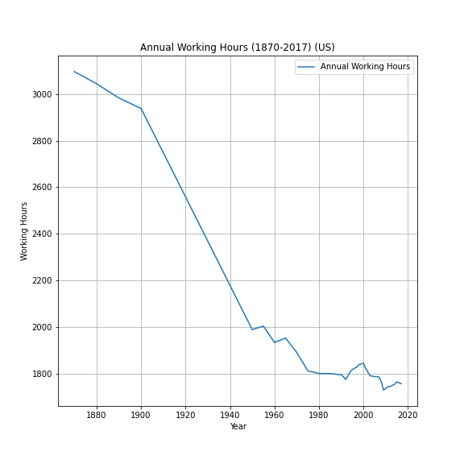
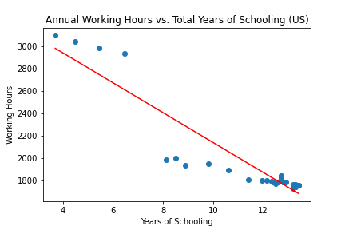
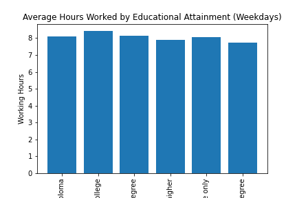
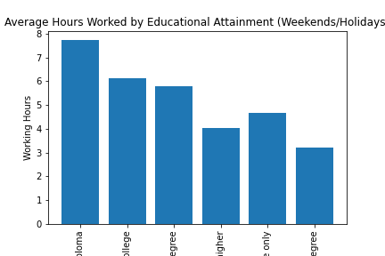

# Dimensions of Quality of Life vs. Working Hours in the U.S.A. #
Over the course of this project, we aimed to find out what circumstances constitute a high quality of life, how they correlate with each other, and how well the U.S. has done at providing good lives for its people over time. We were interested in uncovering the relationships between the changes in annual working hours per worker and other dimensions of quality of life in the U.S., dating back to 1870. The dimensions of quality of life which we examined were life expectancy, access to high-speed internet, average years of educational obtainment, unemployment rate, access to recreational facilities, and rates of alcohol and drug consumption. 

Quality of life is defined as the degree to which an individual is healthy, comfortable, and able to participate in everyday activities.  

**How does time spent working affect and interact with other quality of life indicators?**

# Technology Used #
- Python
- Pandas
- Numpy
- Matplotlib
- API Request
- Jupyter Notebook

### Work-Life Balance: Average Hours Spent Working (U.S.) ###

Advantages of Work-Life Balance:  

- Increased productivity.  
- Less instances of sickness and absenteeism.  
- Staff feeling valued and that their personal and/or family life is important.  
- Improvements in employee mental health and well-being.  

### Years of Schooling vs. Average Working Hours ###

**Question:** Is there a relationship between years of school and working hours?
**Null Hypothesis:** There is no relationship between years of schooling and working hours.

y = -133.39x + 3474.69
R-squared = 0.8592

**Results:** Reject the null hypothesis. There is a strong negative relationship between years of schooling and working hours.

### Chi-Square: Educational Attainment vs. Working Hours ###

**Question:** Does educational attainment impact time spent working weekends and holidays? Is there a significant difference between these groups?.  
**Null Hypothesis:** There is no significant difference in average hours spent working weekends and holidays between groups of educational attainment.  
Critical Value= 11.07
Chi-Squared = 2.48	p-value= 0.778
**Results:** Fail to reject the null hypothesis. There is no statistically significant difference between educational attainment and hours spent working weekends and holidays.  

### Work-Life Balance: Life Expectancy (U.S.A.) ###
Life expectancy is the key metric for assessing population health, it captures the mortality along the entire life course. It tells us the average age of death in a population.

**Question:** Is there a relationship between working hours and Life Expectancy?

**Observations:** We can see a strong correlation between these two but does reducing work hours increase life expectancy, we have to consider other aspects like the Fight for human rights and fair work conditions, health advances, technology advances and world organizations where they work can offer better life conditions to the entire population.

## Work-Life Balance: Unemployment rate (U.S.A.) ##
Unemployment refers to the share of the labor force that is without work but available for and seeking employment. Definitions of labor force and unemployment differ by country.

**Question:** Is there a relationship between working hours and Unemployment Rate?

**Observations:** Due the weak correlation changing the working hours doesnt affect unemployment rate

### Mean Hrs Worked/Worker/Year vs. % of Households with Landline ###

y=-.049x+172.963
r=-.497
r^2=.247
There is a weak negative correlation between working hours and the landline coverage in the U.S. It seems that only ~24.7% of any increase in the landline coverage corresponds to a decrease in the mean hours worked/year/worker.

### Mean Hrs Worked/Worker/Year vs. Deaths by Homicide/100,000 People/Year ###

y=-.005x+16.157
r=-.471
r^2=.222
There is a weak negative correlation between working hours and the homicide rate in the U.S. It seems that only ~22.2% of any increase in the homicide rate corresponds to a decrease in the mean hours worked/year/worker.

### Conclusions ###
As years of schooling achieved by the U.S. population have increased, the mean working hours/year have decreased. However, there is no significant correlation between one’s level of education and the chance that one will have to work weekends or on holidays. As mean working hours decrease, life expectancy, landline coverage, and homicide rate all tend to increase. However, life expectancy has a much stronger correlation with mean working hours than do the landline coverage and the homicide rate. Finally, there is a very weak negative correlation between the unemployment rate and the mean hours worked/year. 
In short, educational attainment, life expectancy, and landline coverage are all desired things which tend to increase as the hours worked/year/worker decrease. Homicide and unemployment are the undesirable dimension of life quality which increase as hours worked decrease. From examining these variables, it seems likely that the overall quality of life improves with decreasing work hours, but the relationship is highly complex and affected by many variables which we did not consider.
